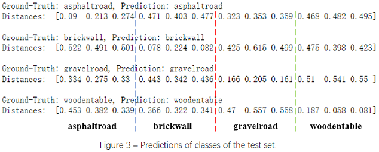

# local-binary-pattern

In this project, we built a texture classifier using Local Binary Pattern (LBP).

| Step                                     | Notebook                       | Document                            |
| ---------------------------------------- | ------------------------------ | ----------------------------------- |
| Part 1 - Compute LBP and Look Into It | [Notebook](lbp_part1.ipynb) | [Document](lbp_report_part1.pdf) |
| Part 2 - Build a Classifier | [Notebook](lbp_part2.ipynb) | [Document](lbp_report_part2.pdf) |
